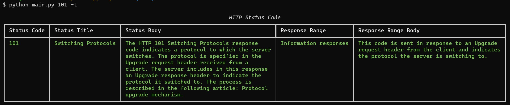
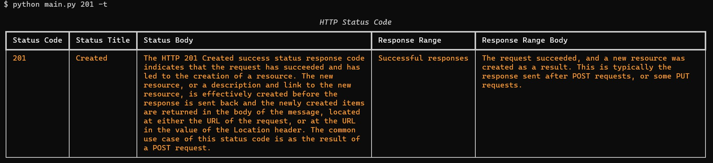
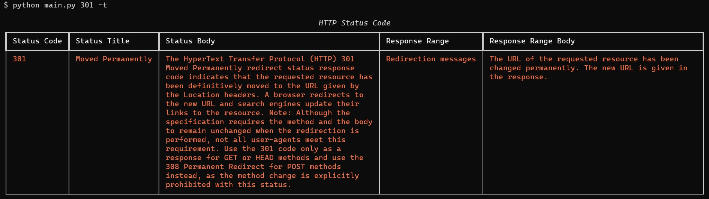
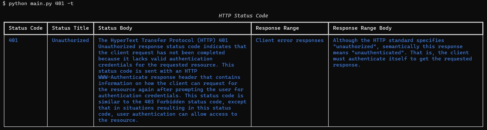
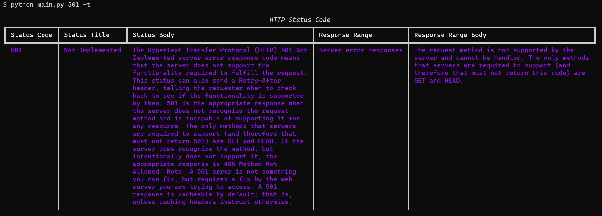
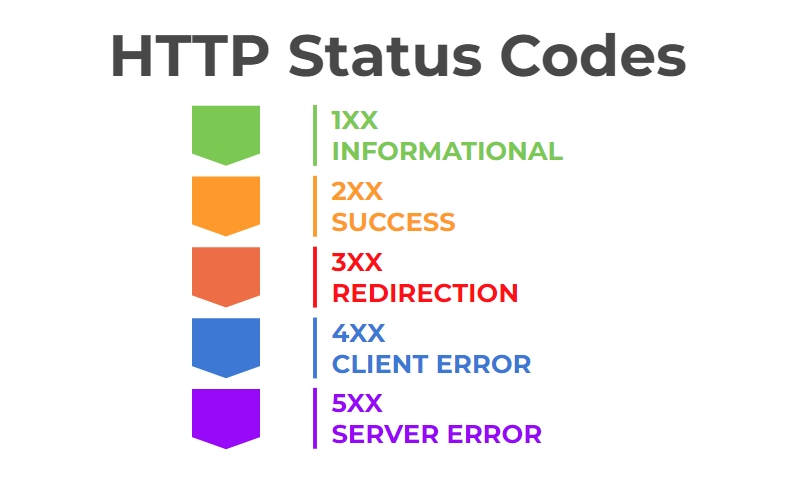

# httpstatus

`httpstatus` helps you find out what the HTTP status code means. Main source of the status code data is [](https://developer.mozilla.org/en-US/docs/Web/HTTP/Status) [Mozilla MDN](https://developer.mozilla.org/en-US/docs/Web/HTTP/Status).

## Usage

| Usage Type          | Usage Code                              |
| ------------------- | --------------------------------------- |
| _default mode_      | `python main.py status_code`            |
| _json mode_         | `python main.py status_code --json`     |
| _json mode_         | `python main.py status_code -j`         |
| _table mode_        | `python main.py status_code --table`    |
| _url mode_          | `python main.py --url example.com`      |
| _url mode in json_  | `python main.py -u example.com -j`      |
| _url mode in table_ | `python main.py -u example.com --table` |

##### Examples:

```python
python main.py 200
```

```python
python main.py 200 --json
```

```python
python main.py 200 --table
```

```python
python main.py --url example.com
```

```python
python main.py -u example.com -j
```

```python
python main.py -u example.com --table
```

### Screenshots

`python main.py 101 -t`



`python main.py 201 -t`



`python main.py 301 -t`



`python main.py 401 -t`



`python main.py 501 -t`



Returned status colors are based on colors used in below image:


[Image source](https://www.automatedtestingwithtuyen.com/post/http-status-codes)

## License

Licensed under the GPLv3 License.
